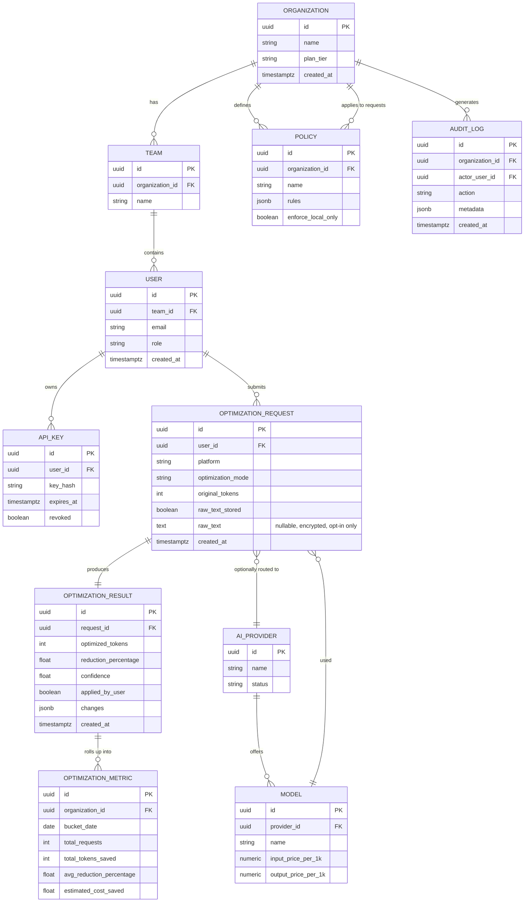

# Database ERD (conceptual)

## Notes

- `OPTIMIZATION_REQUEST.raw_text` is nullable and only populated when `raw_text_stored = true`
  (opt-in per user/org policy); when stored, it is encrypted at the column level.
- `OPTIMIZATION_METRIC` is a pre-aggregated rollup table so the dashboard/analytics service
  never needs to scan raw request rows for common queries.
- Business logic never touches these tables directly — access goes through a repository layer
  in `services/optimization-service/app/infrastructure`.
- Migrations managed via Alembic (SQLAlchemy 2.x).
