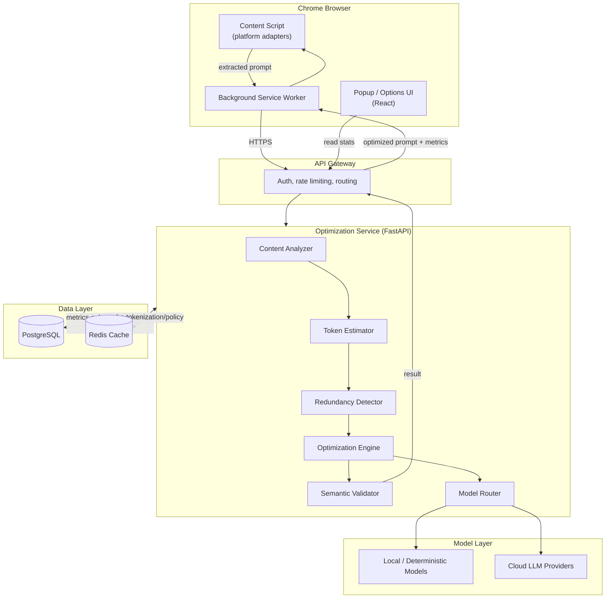
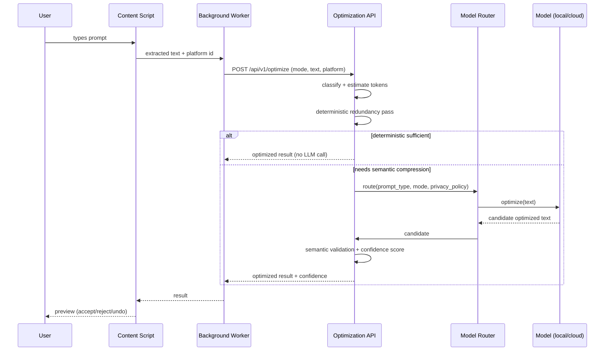

# System Overview — High-Level, Component, and Data Flow Architecture

## 1. High-level architecture

## 2. Component architecture

| Component | Responsibility | Replaceable independently? |
|---|---|---|
| Platform Adapter | DOM detection/insertion for one AI site | Yes — isolated per adapter |
| Content Script | Wires adapter to extension messaging | No (thin glue) |
| Background Service Worker | Auth, API calls, cross-tab state | Partially |
| Popup/Options UI | User-facing controls & dashboard | Yes (pure UI) |
| Content Analyzer | Classifies prompt type (code/doc/chat/etc.) | Yes |
| Token Estimator | Provider-specific token counting | Yes, via `ITokenizer` |
| Redundancy Detector | Deterministic dedup/compression | Yes |
| Optimization Engine | Orchestrates strategies A–F | Yes, via `IOptimizationStrategy` |
| Semantic Validator | Confidence scoring pre-apply | Yes |
| Model Router | Chooses local vs cloud optimizer | Yes |
| Provider Adapters | Talk to OpenAI/Anthropic/Gemini/local | Yes, via `IAIProvider` |

## 3. Data flow (single optimization request)

## 4. Key architectural principle

The **cheapest safe transformation wins**: deterministic compression is tried first; an LLM
call only happens when deterministic/structural optimization is insufficient and the estimated
token savings justify the added latency/cost (see cost-optimization rule in
[docs/product/mvp-scope.md](../product/mvp-scope.md)).
